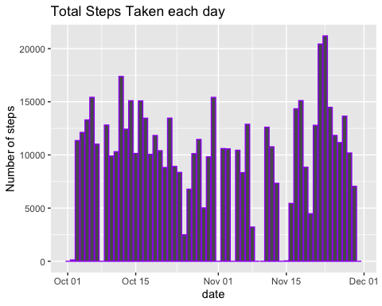
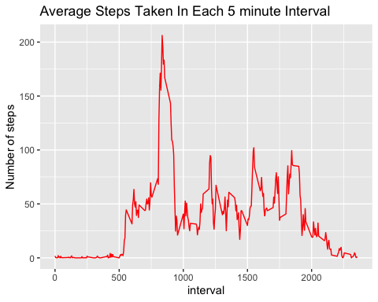
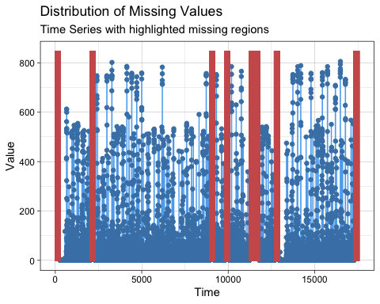
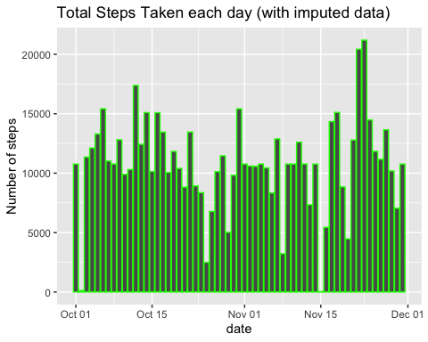
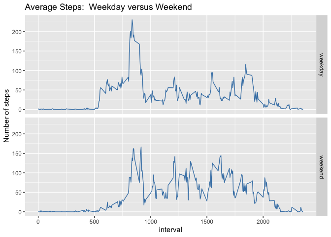

## Loading and preprocessing the data

Here is the code to load, read, and inspect the data, which consists of two months of number of steps taken in 5 minute intervals from an anonymous individual collected during October and November, 2012. 


```r
library(downloader)
library(readr)

fileUrl <- "https://d396qusza40orc.cloudfront.net/repdata%2Fdata%2Factivity.zip"
download.file(fileUrl, destfile = "steps.csv", method="curl")
unzip("steps.csv", exdir="./")
steps <- read_csv("steps.csv")
```

```
## 
## ── Column specification ────────────────────────────────────────────────────────
## cols(
##   steps = col_double(),
##   date = col_date(format = ""),
##   interval = col_double()
## )
```

Here is the code to find the total number of daily steps.

```r
library(dplyr)
```

```
## 
## Attaching package: 'dplyr'
```

```
## The following objects are masked from 'package:stats':
## 
##     filter, lag
```

```
## The following objects are masked from 'package:base':
## 
##     intersect, setdiff, setequal, union
```

```r
daily <- steps %>% group_by(date) %>% summarize(daily_steps = 
                                sum(steps, na.rm=TRUE))
```

Here is the code to create the histogram of the total number of daily steps.

```r
library(ggplot2)
g <- ggplot(data=daily, aes(x=date, y=daily_steps))
g + geom_col(col="purple")+ 
     labs(y="Number of steps") +
     ggtitle("Total Steps Taken each day")
```

<!-- -->

## What is mean total number of steps taken per day?

```r
daily_mean <- mean(daily$daily_steps, na.rm = TRUE)
daily_median <- median(daily$daily_steps, na.rm = TRUE)
```

* The daily average number of steps is 9354. 
* The daily median number of steps is 10395.

## What is the average daily activity pattern?

Here is the code to find and plot the average number of steps per 5 minute interval.


```r
interval_average <- group_by(steps, interval) %>% summarize(average_steps = 
                                                               mean(steps, na.rm=TRUE))
h <- ggplot(data=interval_average, aes(x=interval, y=average_steps))
h + geom_line(col="red")+ 
        labs(y="Number of steps") +
        ggtitle("Average Steps Taken In Each 5 minute Interval")
```

<!-- -->

## Find 5-minute interval that, on average, contains the maximum number of steps

Here is the code to find the interval with the maximum number of steps.

```r
max_steps_interval <- interval_average$interval[which.max(interval_average$average_steps)]
```

* The 5-minute interval that contains the most steps is 835, or 8:35 in the morning.

## Imputing missing values

* There are several days with all NAs.  Here is some code that plots the 
  distribution of NAs and computes the total number of missiong observations

```r
library(imputeTS)
```

```
## Registered S3 method overwritten by 'quantmod':
##   method            from
##   as.zoo.data.frame zoo
```

```r
sum <- sum(is.na(steps$steps))
ggplot_na_distribution(steps$steps)
```

<!-- -->

* The number of missing observations is 2304.

Here is some code that imputes the values for each 5 minute interval using 
the average value for the corresponding interval on the days with complete data. 
Thanks to Mentor Usama A.F. Khalil's response to Giulio Mario Martena's question 
"Imputing NAs with specific mean?" for suggesting this approach [1].

```r
steps$steps_filled <- ave(steps$steps,steps$interval,FUN=function(x) 
        ifelse(is.na(x), mean(x,na.rm=TRUE), x))

new_daily <- steps %>% group_by(date) %>% summarize(daily_steps = 
                                                       sum(steps_filled))
```

Here is the code to create the new histogram of daily steps with the imputed data.

```r
g <- ggplot(data=new_daily, aes(x=date, y=daily_steps))
g + geom_col(col="green")+ 
        labs(y="Number of steps") +
        ggtitle("Total Steps Taken each day (with imputed data)")
```

<!-- -->

Here is the code to recalculate the mean and median total number of steps taken per day.

```r
filled_mean <- mean(new_daily$daily_steps)
filled_median <- median(new_daily$daily_steps)
```
* The new daily average number of steps is 10766. 
* The new daily median number of steps is 10766.

The new daily average and median are higher with the imputed data. I am guessing that the mean and the median are identical due to the imputation method.  (I created a data set (new_daily_data.csv), and the totals for the days with missing data are equal to 10766

## Are there differences in activity patterns between weekdays and weekends?

* Find out days of the week usng weekday()
* Create a factor variable with two levels, "weekday" and "weekend"
* Average the steps taken across all weekday days / weekend days

Here is the code to create the factor variable.  Note that in order to keep the factor variable to use in the panel plot, you must set .groups="keep".

```r
library(forcats)
steps$day <- weekdays(steps$date)

steps$factor <- factor(steps$day, levels = c("Monday", "Tuesday", "Wednesday",
                                    "Thursday", "Friday", "Saturday", "Sunday"), 
                         labels = c("weekday", "weekday","weekday", "weekday",
                                    "weekday", "weekend", "weekend"))

average <- steps %>% group_by(interval, factor) %>% summarize(average_steps = 
                                 mean(steps_filled), .groups="keep")
```

Here is the code to create the panel plot.

```r
w <- ggplot(data=average, aes(x=interval, y=average_steps))
w + geom_line(col="steelblue") + ggtitle("Average Steps:  Weekday versus Weekend") +
         facet_grid(rows=vars(factor)) + 
         labs(y="Number of steps") 
```

<!-- -->


Based on the panel plot, this individual took--on average--more steps in the early morning during the weekdays, and walked slightly more later in the day on the weekend. 

[1] https://www.coursera.org/learn/reproducible-research/discussions/all/threads/R69DZZvFTGivQ2WbxcxoqA
